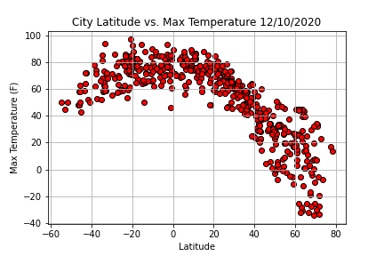
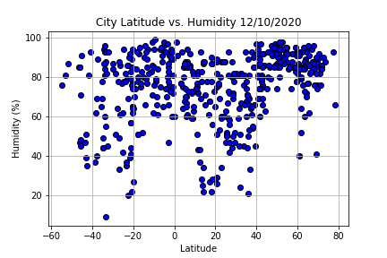
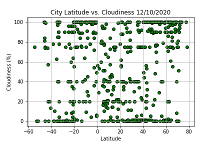
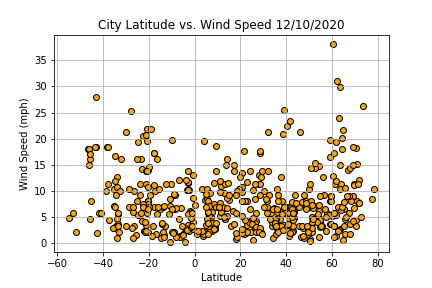
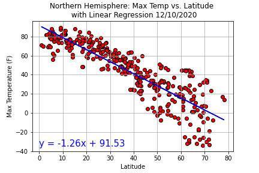
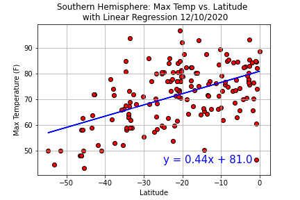
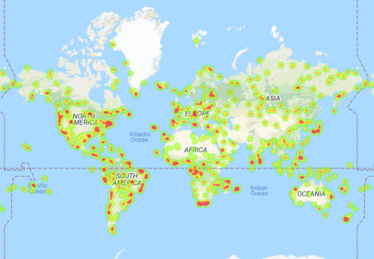
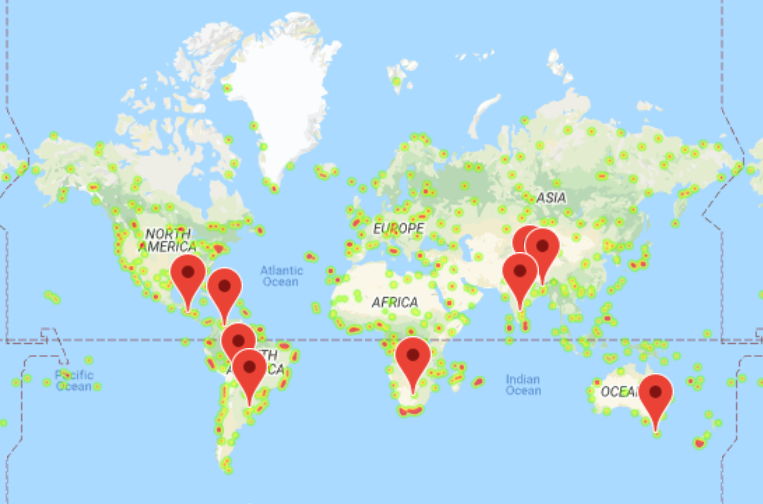
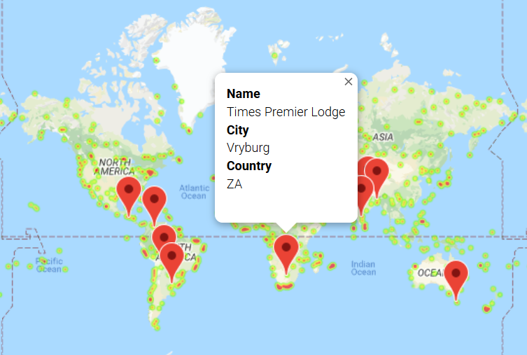

# Weather_Analysis_with_Python_and_API_Requets
Analyzing weather patterns closer to the equator using Python and API Requests

The purpose this project is to analyze the weather for 500+ random cities and find nearby hotels in cities with "ideal weather."

## Table of Contents 
* [General Info](#General-info)  
* [Technologies](#technologies)  
* [Setup](#setup)  
* [Data Sources](#data-sources)
* [Images](#images)  
* [Overview](#overview)  

## General Info
This code is to analyze the current weather conditions in the randomized cities to evaluate weather patterns by latitude. The second part of this code is to narrow down the cities to those with current conditions that are considered "ideal weather." Ideal Weather is between 70 and 80 degrees (F), with wind speed less than 10 mph, and with zero percent cloudiness. From that dataset, the code is looking for the nearest hotel within 5000 meters of the city's latitude and longitude. 

## Technologies
Project is created with:  
* Pandas 1.0.5  
* Jupyter Notebook 4.6.3  
* Matplotlib 3.3.2  
* Python 3.6.10
* CitiPy 0.0.5
* gmaps 

## Setup
To run the code, open it with jupyter Notebook. Citipy and gmaps will need to be installed. You will need an API key for open weather and google.

## Data Sources 
API:
http://api.openweathermap.org/data/2.5/weather  
CitiPy:  
https://pypi.org/project/citipy/  
gmaps:   
https://developers.google.com/maps/documentation/javascript/places
https://maps.googleapis.com/maps/api/place/nearbysearch/json?

## Images
There are 15 saved images total in this repository. 12 are scatter plots from the WeatherPy file, and 3 are maps from the VacationPy file. 
Please see the images folder or the jupyter notebook for more information about all the images. Only 6 of the 12 scatter plots are shown on the ReadMe file.    

Image 1:  City Latitude vs Max Temp from WeatherPy  
  
Image 2:  City Latitude vs Humidity from WeatherPy  
  
Image 3:  City Latitude vs Cloudiness from WeatherPy  
  
Image 4:  City Latitude vs Wind Speed from WeatherPy  
  
Image 5:  Northern Hemisphere Max Temp vs Latitude w/Linear Regression from WeatherPy  
  
Image 6:  Southern Hemisphere Max Temp vs Latitude w/Linear Regression from WeatherPy  
  
Image 7 (13 of the total): Screenshot of the heat map results from VacationPy  
   
Image 8 (14 of the total): Screenshot of the map results with hotel pins from VacationPy  
   
Image 9 (15 of the total): Screenshot of the map results with hotel pins and labels from VacationPy  
  

## Overview
In the first jupyter notebook code called WeatherPy, the data set grabs 500+ random cities all over the world and looks up the current weather conditions for the city. This data was last updated on 12/10/2020. We have analyzed the max temperature, humidity, cloudiness, and wind speed against the latitude. The purpose is to find any weather patterns as we move closer and farther away from the equator (latitude = 0).  

From the scatter plots, we can see there is only strong correlation for the maximum temperature with it increasing as we get closer to the equator and decreasing as we move farther from it. The other conditions were much more scattered, and any correlation would be considered much weaker. The maximum temperature has a very strong progression across the plot. It should be noted that the cities with humidity = 100% were removed from the data set before the plots were made. 

The data was further analyzed by breaking the cities into their prospective hemispheres. It should be noted that the was much more data from the original data set for the northern hemisphere than the southern hemisphere. When breaking down the data by hemisphere, we can see the maximum temperature has the stronger correlation to latitude just like in the initial maximum temperature plot. Both plots for temperature in their respective hemispheres had a p-value over 0.5, but none of the other conditions had a p-value above 0.4 with only two being above 0.3. This continues to show that humidity, cloudiness, and wind speed are much less correlated to the latitude/equator. 

In the VacationPy jupyter notebook, the city weather data from WeatherPy was taken and mapped onto a heat map. The data was further analyzed to find cities with "ideal conditions." The ideal conditions were set as between 70 and 80 degrees (F), wind speed less than 10 mph, and zero percent cloudiness. With those parameters, only 9 cities were found to match. From that point, the nearest hotel was found for each city. Those hotels were pinned to the map with labels. Image 8 and 9 (14 and 15 in the folder respectively) are of the same map, but one is a screenshot showing the label information for the hotel. Most of the cities that had ideal weather conditions were closer to the equator. 